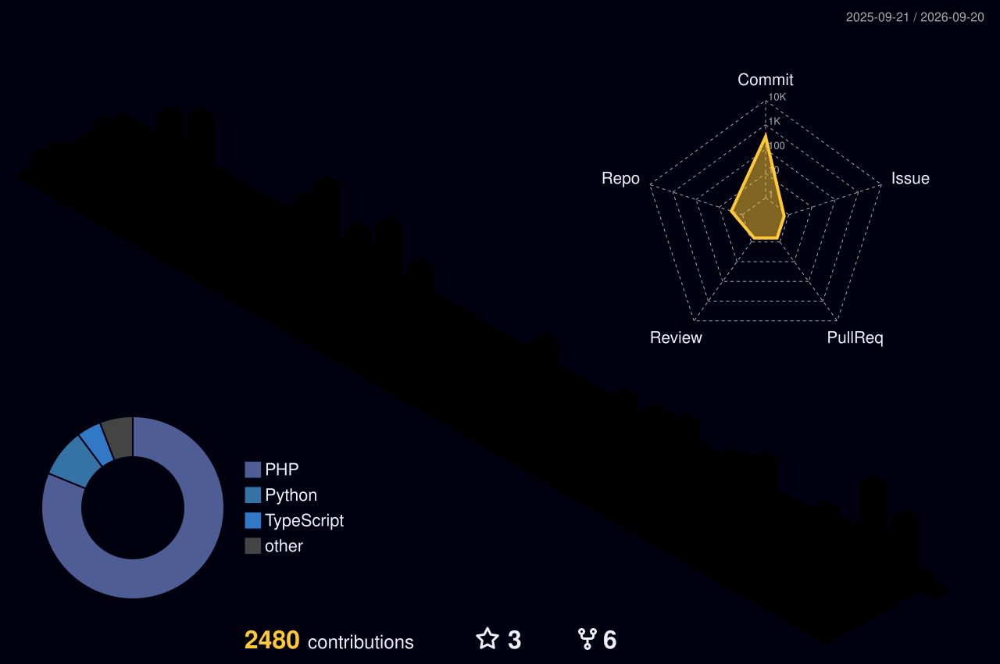

 

## About

Technical Lead and hands-on software engineer with 9+ years building reliable backend, web, mobile, and cloud products. I lead teams and delivery while staying close to architecture, production code, and the details that make systems dependable.

## Core Stack

  

  Laravel · Node.js · TypeScript · AWS · React Native · APIs · Serverless · CI/CD

## Career Highlights

### Gapstars — Technical Lead

Led a three-person team and backend delivery for a pet-identification platform serving 1M+ users. Built and improved production services with Laravel, MySQL, AWS Lambda, Node.js, and Python while strengthening release quality and cloud cost control.

### Adventus.io — Associate Technical Lead / Senior Software Engineer

Led sprint delivery and mentored engineers within an eight-person team. Architected 5+ Node.js and TypeScript AWS Lambda microservices, supported Terraform-managed infrastructure, and raised engineering standards through testing and code review.

## Selected Builds

<table>
<tr>
<td width="33%" valign="top">

### 💎 Gemora.io

Laravel marketplace and live-auction platform for natural gemstones and fine jewellery, covering seller onboarding, listings, bidding, and completion workflows.

`Laravel` `MySQL` `Marketplace`

</td>
<td width="33%" valign="top">

### 🛒 BLIZMO

Commerce and field-sales product for shop visits, stock movement, POS printing, returns, payments, and daily operations.

`React Native` `Expo` `APIs`

</td>
<td width="33%" valign="top">

### 🐾 PETMARTZ

Pet-product ecosystem with profiles, reminders, directories, marketplace concepts, and cross-platform experiences.

`Next.js` `React Native` `Supabase`

</td>
</tr>
</table>

## GitHub Activity

 

  

  

  

  

  

Building systems that survive contact with reality.

  

