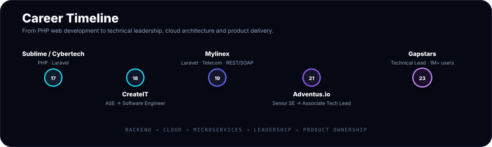
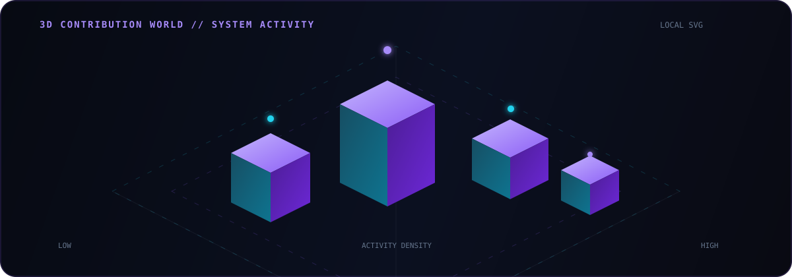
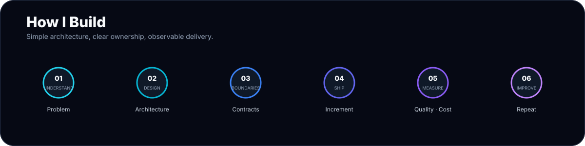

 

  

## About

**Technical Lead and hands-on software engineer with 9+ years of experience** building Laravel/PHP platforms, Node.js/AWS serverless systems, APIs, web applications and cross-platform mobile products. I work across architecture, delivery, cloud infrastructure, code quality, release management and mentoring while staying close to production code.

<table>
<tr>
<td align="center" width="25%"><b>9+ Years</b> Software Engineering</td>
<td align="center" width="25%"><b>1M+ Users</b> Current Platform</td>
<td align="center" width="25%"><b>5+ Services</b> Node.js + AWS Lambda</td>
<td align="center" width="25%"><b>50 / 50</b> Leadership + Hands-on</td>
</tr>
</table>

## Engineering System

  

<table>
<tr>
<td width="33%" valign="top">

### Architecture
- System boundaries
- REST / GraphQL APIs
- Multi-tenant systems
- Data modelling
- Microservices
- Serverless architecture

</td>
<td width="33%" valign="top">

### Delivery
- Sprint planning
- Code review
- TDD / SOLID
- CI/CD
- Releases
- Production support

</td>
<td width="33%" valign="top">

### Cloud & Product
- AWS Lambda / EC2
- Terraform
- Docker / Linux
- Cost optimisation
- Observability
- Product analytics

</td>
</tr>
</table>

## Technology Stack

 

| Area | Technologies |
|---|---|
| **Backend & APIs** | PHP · Laravel 13 · Node.js · TypeScript · Python · REST · GraphQL · SOAP · Microservices · Serverless |
| **Cloud & DevOps** | AWS Lambda · EC2 · DynamoDB · Terraform · Serverless Framework · Docker · Linux · CI/CD · SonarQube |
| **Data & Platforms** | MySQL · PostgreSQL · MongoDB · DynamoDB · Firebase · Supabase · BigQuery · Power BI · Tableau |
| **Web & Mobile** | Vue.js · Next.js · React Native · Expo · JavaScript · TypeScript · Tailwind CSS |
| **Engineering** | TDD · SOLID · Repository Pattern · Lucid Architecture · Code Review · Agile/Scrum · Mentoring |
| **AI-assisted Development** | OpenAI Codex · Cursor · Claude Code · Google Antigravity · RAG / Agentic AI exploration |

## Career Timeline

  

### Gapstars — Technical Lead
**Oct 2023 – Aug 2026 · Pet-identification platform**

- Led a 3-person engineering team while mentoring engineers and maintaining a 50/50 leadership / hands-on balance.
- Owned backend delivery for a platform serving **1M+ users**.
- Worked with Laravel 13, PHP, MySQL, AWS Lambda, Node.js and Python.
- Reduced AWS operating costs and introduced PR quality gates and SonarQube analysis.
- Built Power BI reports for business and product insights.

### Adventus.io — Associate Technical Lead / Senior Software Engineer
**Sep 2021 – Oct 2023 · Education / recruitment platform**

- Promoted from Senior Software Engineer to Associate Technical Lead.
- Led sprint planning and delivery within an 8-person engineering team and mentored 5 engineers.
- Architected and delivered **5+ Node.js / TypeScript AWS Lambda microservices**.
- Worked with Terraform-managed infrastructure, CI/CD, Laravel, REST/GraphQL APIs and multi-tenancy.
- Strengthened engineering standards with TDD, SOLID, Repository Pattern and Lucid Architecture; received an Employee of the Month award.

### Earlier Engineering Experience

| Period | Company | Role / Focus |
|---|---|---|
| **2019 – 2021** | **Mylinex International** | Software Engineer — Laravel · Telecom · MySQL · MongoDB · REST/SOAP · Linux |
| **2018 – 2019** | **CreateIT Solutions** | Associate SE → Software Engineer — Laravel · AWS EC2 · Linux · Vue · REST APIs |
| **2017 – 2018** | **Cybertech International** | Laravel Web Developer |
| **2017 – 2018** | **Sublime IT Solutions** | Web Developer — PHP |

## Selected Builds

<table>
<tr>
<td width="50%" valign="top">

### 💎 Gemora.io

Laravel marketplace and live-auction platform for natural gemstones and fine jewellery, including seller onboarding, listings, live bidding, automated winner selection and completion workflows.

`Laravel` `MySQL` `Marketplace` `Auctions`

</td>
<td width="50%" valign="top">

### 🛒 BLIZMO

Commerce and field-sales product covering shop visits, stock movement, POS printing, returns, payments and operational workflows.

`React Native` `Expo` `APIs` `POS`

</td>
</tr>
<tr>
<td width="50%" valign="top">

### 🐾 PETMARTZ

Pet product ecosystem spanning pet profiles, reminders, directories, marketplace concepts and cross-platform delivery.

`Next.js` `React Native` `Supabase`

</td>
<td width="50%" valign="top">

### 📡 KENTACY

Messaging platform focused on API-driven SMS and WhatsApp workflows.

`Laravel` `Vue` `Redis` `Messaging`

</td>
</tr>
</table>

### Mobile & Open Source

- Built React Native / Expo applications using Supabase and Firebase and managed production releases to the **Apple App Store and Google Play**.
- Stack Overflow contributor with **598k people reached and 25 answers**.
- Maintains React Native Bluetooth ESC/POS tooling on GitHub.

## Education

<table>
<tr>
<td width="50%">

### BEng (Hons) Software Engineering
**London Metropolitan University · United Kingdom**

</td>
<td width="50%">

### Higher National Diploma in Information Technology
**SLIATE — Labuduwa · Sri Lanka**

</td>
</tr>
</table>

## GitHub Stats

  

## Contribution Activity

  

  

## How I Build

  

**SIMPLICITY · OWNERSHIP · RELIABILITY · CURIOSITY · CONTINUOUS IMPROVEMENT**

 

### BUILD SYSTEMS THAT SURVIVE CONTACT WITH REALITY.

Architecture is useful when it helps teams ship reliable software.

  

