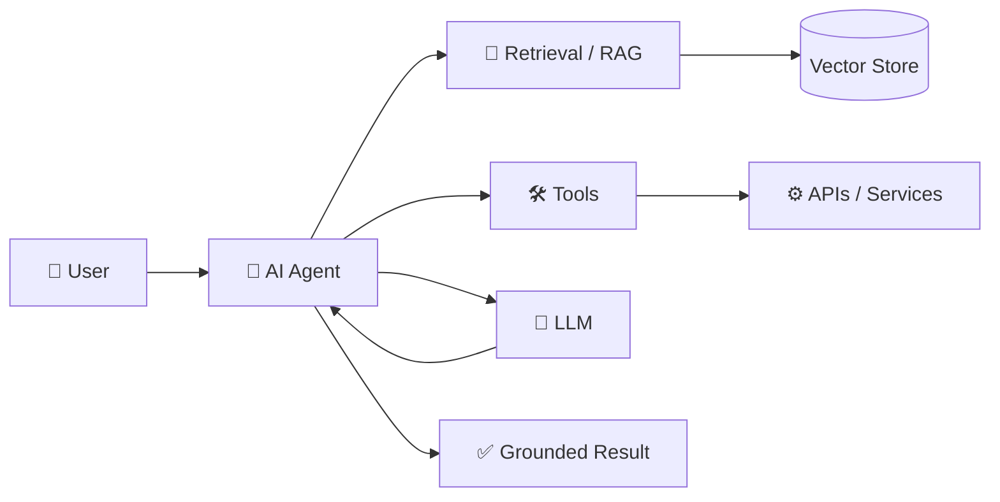

<div align="center">


<a href="https://github.com/ccdilan">

</a>

<br/>

<a href="https://github.com/ccdilan"></a>
<a href="https://github.com/ccdilan?tab=repositories"></a>
<a href="https://www.linkedin.com/"></a>

</div>

---

## 👨‍💻 About Me

I am a **Software Engineer / Tech Lead** focused on building reliable, scalable and maintainable products from idea to production.

```text
┌──────────────────────────────────────────────────────────────────┐
│  ENGINEERING FOCUS                                               │
├──────────────────────────────────────────────────────────────────┤
│  Backend        Laravel · PHP · REST APIs · MySQL               │
│  Frontend       React · Vue · Inertia · Tailwind                │
│  Mobile         React Native · Expo                             │
│  Architecture   Modular systems · APIs · Multi-tenant SaaS      │
│  Cloud           AWS · Vercel · Linux · Nginx · Docker           │
│  AI              RAG · LLMs · AI Agents · MCP · AI-assisted dev │
└──────────────────────────────────────────────────────────────────┘
```

### 🧠 Current Direction

I am actively deepening my work in **AI Agentic Engineering** — designing systems where LLMs can reason over context, use tools, retrieve knowledge and execute multi-step workflows.

**Current learning / building areas:**

`RAG` · `Embeddings` · `Vector Search` · `LLM Tool Calling` · `AI Agents` · `MCP` · `Agentic Workflows` · `AI-assisted Software Engineering`

---

## ⚡ Technology Stack

<div align="center">


</div>

---

## 🤖 AI & Agentic Engineering



**What I am interested in:**

- 📚 **RAG systems** — document ingestion, chunking, embeddings, retrieval and grounded generation
- 🤖 **AI agents** — tool use, planning, memory and multi-step execution
- 🔌 **MCP** — connecting models to real tools and data
- 🧩 **Agentic architecture** — reliable workflows rather than simple prompt → response applications
- 🛠️ **AI-assisted engineering** — using coding agents as engineering collaborators

---

## 🚀 Selected Projects

| Project | What it does | Focus |
|---|---|---|
| 💎 **Gemora** | Gem marketplace & auction platform | Laravel · Marketplace · Auctions |
| 🛒 **Blizmo** | POS / commerce ecosystem | React Native · Expo · APIs |
| 🐾 **PetMartz** | Pet community & marketplace | React Native · Supabase |
| 📡 **Kentacy** | SMS / communication platform | APIs · Messaging · SaaS |
| 🧠 **RAG Generator** | Runtime document → RAG application | AI · RAG · LLMs |

> More production systems and experiments live across my repositories.

---

## 📊 GitHub Analytics

<div align="center">

<a href="https://github.com/ccdilan">

</a>
<a href="https://github.com/ccdilan">

</a>

<br/>


</div>

---

## 🐍 Contribution Activity

<div align="center">


</div>

---

## 🌌 3D Contribution Graph

<div align="center">


</div>

---

## 🧩 Engineering Principles

```text
01  Simple systems are easier to scale.
02  Architecture should serve the product, not impress the diagram.
03  Automate repetitive engineering work.
04  Observability is part of the feature.
05  AI should be grounded in reliable context and tools.
06  Ship → measure → learn → improve.
```

---

## 📈 What I Like Building

`SaaS` · `Marketplaces` · `FinTech` · `Mobile Apps` · `Developer Tools` · `AI Applications` · `Automation` · `API Platforms`

---

## 🤝 Let's Connect

<div align="center">

<a href="https://github.com/ccdilan"></a>
<a href="https://www.linkedin.com/"></a>

<br/><br/>


</div>
