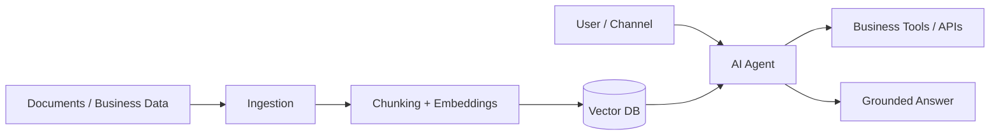

<div align="center">


<br/>

<a href="https://github.com/ccdilan"></a>

<br/><br/>

<a href="https://github.com/ccdilan"></a>
<a href="https://github.com/ccdilan?tab=followers"></a>
<a href="https://github.com/ccdilan?tab=repositories"></a>

</div>


## `01 // ENGINEER.exe`

```text
> role        Technical Lead / Software Architect
> experience  9+ years building and shipping software
> focus       scalable backend systems, product engineering, cloud, AI
> mindset     simplify complexity → create boundaries → ship → observe → improve
> location    Sri Lanka · building for local and international products
```

I work across **architecture, backend, web, mobile, cloud infrastructure and technical leadership**. My strongest area is turning product requirements into systems that teams can actually build, operate and evolve.

Current engineering interest: **RAG systems, AI agents, tool-calling, automation, evaluation and production-grade LLM applications.**


## `02 // SYSTEM MAP`

<div align="center">
  
</div>

<table>
<tr>
<td width="33%" valign="top">

### ⚙️ Architecture

- System boundaries
- API design
- Data modelling
- Event-driven workflows
- Reliability & observability
- Performance & cost control

</td>
<td width="33%" valign="top">

### 🚀 Delivery

- Technical planning
- Code review & standards
- CI/CD and releases
- Production support
- Team mentoring
- Incremental delivery

</td>
<td width="33%" valign="top">

### 🤖 AI Engineering

- RAG pipelines
- Vector search
- Tool / function calling
- Agent workflows
- Guardrails & evaluation
- LLM observability

</td>
</tr>
</table>


## `03 // TECHNOLOGY STACK`

<div align="center">


</div>

<br/>

| Layer | Tools & Technologies |
|---|---|
| **Backend** | PHP · Laravel · Node.js · Python · REST APIs · Microservices |
| **Frontend** | JavaScript · TypeScript · React · Vue · Next.js · Tailwind CSS |
| **Mobile** | React Native · Expo |
| **Data** | MySQL · PostgreSQL · Redis · Supabase · Vector Databases |
| **Cloud / DevOps** | AWS · Lambda · Docker · Linux · Nginx · Vercel · GitHub Actions |
| **AI / LLM** | RAG · Embeddings · Retrieval · Agentic Workflows · Tool Calling · LLM Evaluation |


## `04 // SELECTED BUILDS`

<table>
<tr>
<td width="50%" valign="top">

### 💎 GEMORA

**Multi-vendor gemstone auction platform** with seller onboarding, bidding, verification, reputation and international expansion flows.

`Laravel` `React/Vue` `MySQL` `Marketplace` `Auctions`

</td>
<td width="50%" valign="top">

### 🛒 BLIZMO

**Sales and field-commerce ecosystem** covering shop visits, inventory movement, POS printing, returns, payments and operational workflows.

`React Native` `Expo` `APIs` `POS` `Mobile`

</td>
</tr>
<tr>
<td width="50%" valign="top">

### 🐾 PETMARTZ

**Pet platform** with pet profiles, vaccination reminders, directories, marketplace features and QR/NFC experiences.

`Next.js` `React Native` `Supabase` `Product`

</td>
<td width="50%" valign="top">

### 📡 KENTACY

**Messaging platform** for SMS and WhatsApp-oriented workflows with sender IDs, templates and API-driven communication.

`Laravel` `Vue` `Redis` `Messaging` `SaaS`

</td>
</tr>
</table>

### 🧠 Current AI build direction



> Designing AI systems so the **knowledge layer stays reusable** while domain-specific business tools can change per company.


## `05 // GITHUB TELEMETRY`

<div align="center">

<a href="https://github.com/ccdilan">
  
</a>
<a href="https://github.com/ccdilan">
  
</a>

<br/><br/>


</div>


## `06 // CONTRIBUTION SIGNAL`

<div align="center">



<br/><br/>

<a href="https://github.com/ccdilan?tab=overview"></a>

</div>


## `07 // 3D CONTRIBUTION WORLD`

<div align="center">


<sub>Self-contained SVG animation — no generated branch required.</sub>

</div>


## `08 // OPERATING PRINCIPLES`

```text
01  Understand the actual product problem
              ↓
02  Design the simplest architecture that can evolve
              ↓
03  Create clear boundaries, contracts and ownership
              ↓
04  Ship small, observable production increments
              ↓
05  Measure behavior, cost, quality and reliability
              ↓
06  Learn → simplify → improve → repeat
```

<div align="center">

### `SIMPLICITY` · `OWNERSHIP` · `RELIABILITY` · `CURIOSITY` · `CONTINUOUS IMPROVEMENT`

<br/>


### BUILD SYSTEMS THAT SURVIVE CONTACT WITH REALITY.

<sub>Architecture is useful only when it helps a team ship reliable software.</sub>

<br/><br/>

<a href="https://github.com/ccdilan?tab=repositories"></a>

</div>
